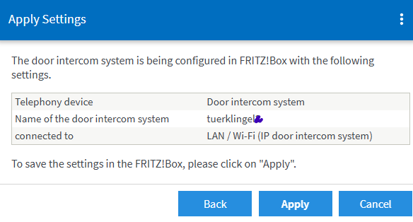

# ESP8266 SIP Doorbell - Getting Started Guide
Attach an ESP8266 board to a classic doorbell and use SIP protocol to make the phones connected to a FritzBox ring.

This ESP8266-based doorbell connects to your FritzBox (or other SIP server) and makes instant phone calls when triggered. The device prioritizes the doorbell function above all else - when powered on or reset, it immediately attempts to connect and ring your phones.

- Hardware setup can be found here: https://www.reichelt.de/magazin/projekte/smarte-tuerklingel/
- or: http://www.roehrenkramladen.de/Tuerklingel/TK-FB-V1a-1.html
- or: https://www.heise.de/select/ct/2017/17/1502995489716437
- or: https://www.heise.de/select/ct/2018/17/1534215254552977

But again: This ESP-Software is **not** TR064 based, but uses SIP for simplicity.

---

## ⚡ Key Features
- Immediate SIP call on wake/reset: SIP initialization and call within seconds
- All configuration and management happens AFTER the call. Also the first configuration
- Starts an Access Point for the initial configuration (see below)
- **Serial Debug**: Traditional UART debugging at 115200 baud
- **WebSerial**: Browser-based debug console accessible via web interface (especially, if you cannot physically connect to the board)
- Both can be enabled/disabled independently via configuration
- Persistent storage of last 100 doorbell events
- Automatic time sync after initial call; configurable NTP server (default: pool.ntp.org) and timezone offset
- Configurable timezone offset
- **Smart Power Management**: Configurable deep sleep timeout (default: 180 seconds)
- Set timeout to 0 to disable deep sleep
- Wake on hardware reset (doorbell button)
- **Flexible Network Configuration**: DHCP or static IP, WiFi station mode for normal operation
- **Automatic AP fallback** when WiFi connection fails
- Web-based configuration portal, status, past events, WebSerial always available
- **Complete SIP Integration**: Compatible with FritzBox and standard SIP servers
- Configurable ring duration (5-120 seconds) and dial text

---

## 🚀 First-Time Setup

### Hardware and Software Requirements
- ESP8266 board (ESP-01, NodeMCU, Wemos D1, etc.)
- USB power or battery power supply
- Adapter to connect to existing, physical door bell circuit (with AC tansformer)
- Doorbell button connected between RST (Reset) and GND - TODO: Might change to better solution
- For deep sleep wake: RST pin connected to doorbell button circuit
- Compile with **Arduino IDE** (.ino is the Sketch File, add the SIP.h and SIP.cpp)

### Initial Configuration

0. **Register Settings at FritzBox**
   - Ensure, you have your WIFI SSID and password at hand.
   - You will also need the IP of your FritzBox (192.168.xx.xx).
   - If you decide to do the Fritzbox-sided registration of the IP-Doorbell first (see below), you should have the SIP user and SIP password as well. Otherwise, enter later.

2. **Power on the ESP8266**
   - On first boot, default WiFi credentials won't work
   - Device automatically starts AP mode for configuration

3. **Connect to the Configuration AP**
   - SSID: **`ESP-Doorbell-Config`**
   - Password: **`12345678`**
   - _Note: If you connect with your mobile phone, you might have to confirm, you want to stay connected to a netwok without internet access!_
   - Device IP: `192.168.4.1` (use Chrome), e.g. on a mobile phone in **same** network

4. **Open the Configuration Portal**
   - Open browser and navigate to: **`http://192.168.4.1`**
   - You'll see the main configuration page

5. **Configure WiFi Settings**
   - **SSID**: Your home WiFi network name
   - **Password**: Your WiFi password
   - **Hostname**: Device hostname (default: ESP-Doorbell)

6. **Configure Network Settings**
   - **Use DHCP**: Check for automatic IP (static IP recommended for most users - speeds up the startup)
   - **Static IP**: the static IP of the doorbell (e.g., 192.168.178.123), if DHCP is unchecked.. TODO: could be removed at all?
   - **Router/Gateway**: Your FritzBox IP (e.g., 192.168.178.1)
   - **Subnet Mask**: Usually 255.255.255.0

7. **Configure SIP Settings** (Critical!)
   - **SIP Port**: Usually 5060 (FritzBox default)
   - **SIP User**: SIP username as configured at FritzBox (e.g., "tuerklingel")
   - **SIP Password**: SIP password from FritzBox
   - **Dial Number**: Number to dial (e.g., **9 to ring at all phones, or specific extension, e.g. "1" - as configured at FritzBox)
   - **Dial Text**: Caller ID text (e.g., "Front Door")
   - **Ring Duration**: How long phones should ring (default: 30 seconds)

8. **Configure Debug Options**
   - **Serial Debug**: Enable for USB/UART debugging
   - **WebSerial Debug**: Enable for browser-based debug console
   - Both can be enabled simultaneously

9. **Configure Time Settings**
   - **NTP Server**: Time server (default: pool.ntp.org)
   - **Timezone Offset**: Seconds from UTC
     - UTC+1 (CET): 3600
     - UTC+2 (CEST): **7200**

10. **Configure Power Management**
   - **Sleep Timeout**: Seconds before deep sleep (default: 180)
   - Set to 0 to disable deep sleep
   - Device stays awake longer when accessed via web interface

11. **Save Configuration**
    - Click "Save & Reboot"
    - Device will reboot in 10 seconds
    - If WiFi connection succeeds, AP mode will be disabled
    - If WiFi fails, AP mode will remain active for reconfiguration
---

## 📞 FritzBox SIP Configuration for the doorbell

Other VoIP capable routers potentially similar (or worldwide VoIP services?)

### Important: The Doorbell needs a fixed IP address. Register at FritzBox after first connect to WIFI and use above.

### Creating a Doorbell Extension

 ### **Log into FritzBox**
   - Navigate to `http://fritz.box`
   - Login to your **FritzBox** admin portal.
   - Go to **"Telephony"** -> **"Telephony Devices"** -> **"Configure New Device"**.
   - Choose **"Door intercom system"** and **Next**.

   ### **Register new Device/SIP credentials**
      + Port: "LAN / Wi-Fi (IP door intercom system)".
      + Name: Tuerklingel.
   
   
   Register a new "Intercom" IP Device

   ### SIP user and Password (also note the IP of your FritzBox)
   
   
   
   ### We need this telephone number for the configuration on the ESP.
   
   
   
   ### You could route this to all phones or a subset of phones.
   
   
   
   ### Check the Settings and apply
   
   
   
   ### List of all registered devices. You can edit anytime with the pen-symbol:
   
   
   
   ### Leave the lower part empty (..for the next fancy project with ESP32-CAM?)
   
   
   
   ### If you forgot to note your SIP-passord/credentials, change here:
   
   


---

## 🔌 Hardware Wiring

### Basic Wiring (Power-on Reset)
```
Power Supply → 3.3V/5V and GND
```
### Deep Sleep Wiring (Recommended)
```
Doorbell Button → RST pin and GND (via 10kΩ pull-up)
Additional: Button → GPIO0 (for programming mode)
Power Supply → 3.3V/5V and GND
```

### LED Indicator
- Built-in LED on GPIO2 (D4) - inverted logic
- ON = SIP call in progress
- Blinks = various status indicators

---

## 🌐 Web Interface Features

### Main Configuration Page (`/`)
- Complete device configuration
- WiFi, SIP, debug, and power settings
- Shows current connection status
- Links to other management pages

### Status Page (`/status`)
- Real-time system information
- WiFi connection details
- Last doorbell call status
- Uptime and memory usage
- Auto-refreshes every 5 seconds

### Event Log (`/events`)
- Last 50 doorbell events
- Timestamp for each event
- Success/failure status
- Wake reason for each trigger
- Sorted newest to oldest

### WebSerial Console (`/webserial`)
- Live debug output in browser
- All serial debug messages
- Auto-refreshes every 5 seconds
- Only works if WebSerial debug is enabled

---

## 🐛 Troubleshooting

### Doorbell Not Ringing

1. **Check WiFi Connection**
   - Access status page
   - Verify "Connected" status
   - Check signal strength (should be > -70 dBm)

2. **Verify SIP Credentials**
   - Double-check username and password
   - Ensure FritzBox extension is active
   - Test dial number works from another phone

3. **Check Event Log**
   - Look for "FAILED" entries
   - Check timestamps to verify button presses are detected

4. **Enable Debug Output**
   - Turn on Serial and/or WebSerial debugging
   - Watch for error messages during call attempts

### Can't Access Configuration

1. **WiFi Connection Failed**
   - Device will automatically start AP mode
   - Connect to `ESP-Doorbell-Config` network
   - Access `http://192.168.4.1`

2. **Forgot IP Address**
   - Check your router's DHCP client list
   - Look for hostname (default: ESP-Doorbell)
   - Or power cycle to trigger AP mode

3. **AP Mode Not Working**
   - Reset device completely
   - Check AP settings in configuration
   - Default AP: `ESP-Doorbell-Config` / `12345678`

### Deep Sleep Issues

1. **Device Won't Wake**
   - Verify RST pin is connected to doorbell button
   - Check for proper pull-up resistor (10kΩ)
   - Try setting sleep timeout to 0 (disabled)

2. **Device Sleeps Too Quickly**
   - Increase sleep timeout in configuration
   - Default: 180 seconds (3 minutes)
   - Any web access resets the timeout

### Time Not Syncing

1. **Check Network Connection**
   - Verify internet access from your network
   - Try changing NTP server
   - Alternative: `time.google.com` or `time.nist.gov`

2. **Timezone Issues**
   - Verify timezone offset is correct
   - Calculate: Hours × 3600 seconds

---

## 💡 Tips & Best Practices

### Optimal Performance
- Use static IP for faster connection
- Place ESP8266 close to WiFi router
- Use quality power supply (stable 5V/3.3V)
- Keep ring duration reasonable (20-40 seconds)

### Reliability
- Enable both Serial and WebSerial debugging initially
- Monitor event log regularly
- Set conservative sleep timeout initially (300+ seconds)
- Test thoroughly before final installation

### Security
- Change default AP password immediately
- Use strong SIP password
- Keep ESP8266 firmware updated
- Consider MAC filtering on FritzBox

### Debugging
- WebSerial is invaluable for installed devices
- Check event log for patterns
- Monitor free heap (should stay > 20KB)
- Watch for WiFi signal strength drops

---

## 📝 Configuration Quick Reference

| Setting | Default | Notes |
|---------|---------|-------|
| WiFi SSID | Your-WiFi-SSID | Must configure |
| WiFi Password | Your-WiFi-Password | Must configure |
| Hostname | ESP-Doorbell | Optional |
| DHCP | Disabled | Enable for simplicity |
| Static IP | 192.168.178.123 | Only if DHCP off |
| Router/Gateway | 192.168.178.1 | FritzBox IP |
| SIP Port | 5060 | Standard |
| SIP User | tuerklingel | From FritzBox |
| SIP Password | xxxxxxx | From FritzBox |
| Dial Number | **9 | All phones |
| Ring Duration | 30 seconds | Adjust as needed |
| Serial Debug | Enabled | For USB debugging |
| WebSerial Debug | Enabled | For remote debugging |
| NTP Server | pool.ntp.org | Time server |
| Timezone | 3600 | UTC+1 (CET) |
| Sleep Timeout | 180 seconds | 3 minutes |
| AP SSID | ESP-Doorbell-Config | Change if desired |
| AP Password | 12345678 | Change immediately! |

---

## 🔄 Operation Flow

1. **Doorbell Pressed** → Hardware reset triggered
2. **ESP8266 Powers On** → Boots in ~100ms
3. **Configuration Loaded** → From EEPROM
4. **WiFi Connection** → 10 second timeout
5. **SIP Initialized** → Immediate if WiFi succeeds
6. **Call Made** → Phones start ringing!
7. **Event Logged** → Saved to persistent storage
8. **Time Synced** → NTP after call completes
9. **Web Server Started** → Configuration available
10. **Management Mode** → Waits for next event or sleep

---

## 📊 Monitoring

### Regular Checks
- **Event Log**: Review for failed calls
- **WebSerial**: Check for error messages
- **Status Page**: Monitor WiFi signal strength
- **Free Heap**: Should stay relatively stable

### Warning Signs
- Increasing failed call rate
- Decreasing free heap memory
- WiFi signal below -80 dBm
- Frequent unexpected resets

---

## 🆘 Support

For issues not covered here:
1. Check WebSerial debug output
2. Review event log for patterns
3. Verify FritzBox extension is working
4. Test with minimal configuration
5. Check power supply stability

---

**Version**: 3.0 (Priority Ring Architecture)  
**Last Updated**: 2025

---

## 🎯 Quick Start Summary

1. Power on ESP8266
2. Connect to `ESP-Doorbell-Config` WiFi (password: `12345678`)
3. Open `http://192.168.4.1` in browser
4. Configure WiFi and SIP settings
5. Save and reboot
6. Press doorbell button to test
7. Check event log and status page
8. Adjust settings as needed


## TODO: Connecting to the doorbell


For deep sleep wake functionality, you need to wire the doorbell button:
```
Button --[10kΩ]-- 3.3V
       |
       +---------- RST pin
       |
       +---------- GND (when pressed)
```


  

> Hauptbestandteil ist ein Optokoppler (PC817), der zwei Stromkreise über eine Lichtbrücke trennt. Damit die LED des PC817 die korrekte Betriebsspannung von 1,2 Volt erhält, ist ein passender Vorwiderstand von 330 Ohm (8 Volt), 560 Ohm (12 Volt) oder 1,2 Kiloohm (24 Volt) erforderlich. Bei 24 V müsste der Widerstand eigentlich 0,5 W aushalten, da in der Regel aber nur wenige Sekunden geklingelt wird, hält auch die 0,25-W-Variante stand. Hat man jedoch Dauerdrücker im Freundeskreis, sollte man vorsichtshalber die 0,5-W-Variante wählen.

> Der Vorwiderstand senkt die Spannung in Durchlassrichtung der Optokoppler-LED zwar ab, jedoch ist bei Wechselspannung auch die Gegenrichtung zu berücksichtigen. Die Durchbruchspannung der LED im PC817 beträgt lediglich 6 Volt. Eine antiparallele Diode führt die gegenläufige Wechselspannung über den Widerstand ab und verhindert so, dass der Optokoppler beschädigt wird. Erfahrene Bastler werden hier schnell bemerken, dass der Ausgang des Optokopplers beim Betätigen des Klingetasters mit der Netzfrequenz pulsiert. Für den Raspberry Pi ist dies jedoch kein Problem. Mittels Polling-Schleife erkennt er die Impulse zuverlässig.

_Source: https://www.heise.de/select/ct/2017/17/1502995489716437_


| DoorBell Transformer<br>(AC current)    |  R1     |
|-----------------|----------|
| 8 V            | 330 Ohm  |
| 12 V           | 560 Ohm  |
| 24 V           | 1,2 kOhm |


       
